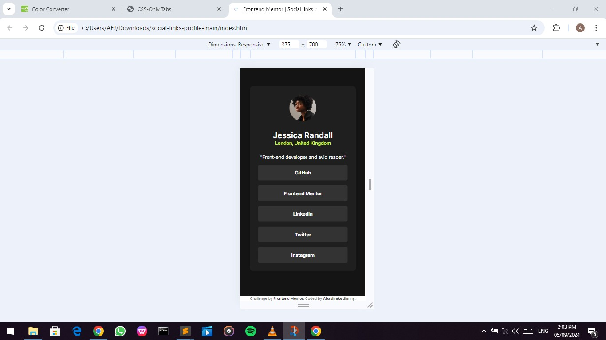
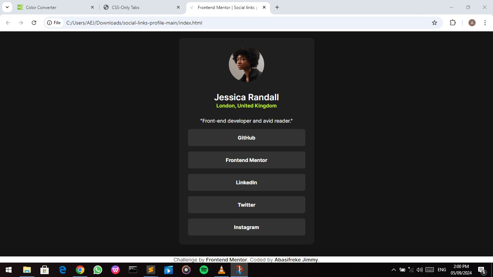

# Frontend Mentor - Social links profile solution

This is a solution to the [Social links profile challenge on Frontend Mentor](https://www.frontendmentor.io/challenges/social-links-profile-UG32l9m6dQ).

## Table of contents

- [Overview](#overview)
  - [The challenge](#the-challenge)
  - [Screenshot](#screenshot)
  - [Links](#links)
- [My process](#my-process)
  - [Built with](#built-with)
  - [What I learned](#what-i-learned)
  - [Continued development](#continued-development)
  - [Useful resources](#useful-resources)
- [Author](#author)
- [Acknowledgments](#acknowledgments)


## Overview

### The challenge

Users should be able to:
- See hover and focus states for all interactive elements on the page

### Screenshot




### Links

- Solution URL: [Add solution URL here](https://your-solution-url.com)
- Live Site URL: [Add live site URL here](https://your-live-site-url.com)

## My process

### Built with

- Semantic HTML5 markup
- CSS custom properties
- Flexbox
- Mobile-first workflow

### What I learned

I learnt how to declare the same style(s) to multiple elements in CSS.

```css
footer, footer a { font-size: 14px; }
```

### Continued development

I want to learn how to use the variable font file not the static type.

### Useful resources

- [W3Schools](https://www.w3schools.com)


## Author

- Frontend Mentor - [@Abascode](https://www.frontendmentor.io/profile/Abascode)


## Acknowledgments

I do want to acknowledge those who commented on my previous frontend solutions. Those comments have been really helpful. 